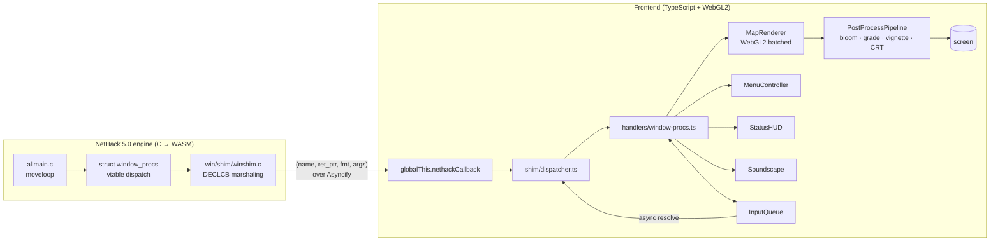
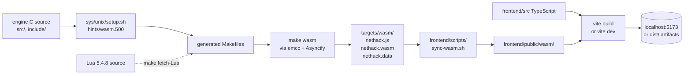
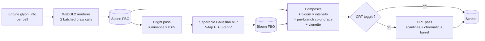

# ModMyNetHack

> *A modernization fork of NetHack 5.0: a high-fidelity 2D web frontend, a working WebGL2 sprite-batched renderer with per-pixel field-of-view, animated terrain shaders, cinematic camera, ambient soundscape, and an engine cleaned of three decades of dead platforms.*

ModMyNetHack ports the world's longest-lived dungeon-crawler into a modern browser without surrendering any of the things that make NetHack *NetHack*. The engine is the canonical NetHack 5.0 codebase — all 130 C source files, the Lua-driven dungeon, the structured save format, the gods, the dungeon, the Amulet — running unchanged inside a WebAssembly module. The frontend is a TypeScript app that consumes that engine through the existing `libnh` + `winshim` seam and renders it with sprite-batched WebGL2, post-processed with bloom + per-branch color grading + optional CRT, narrated by a crossfading ambient soundscape, framed by illustrated bookend screens, and made accessible from day one.

## Lineage at a glance

> **Rogue (1980)** → **Hack (1982)** → **NetHack (1987)** → 3.0 → 3.1 → … → 3.6 → **NetHack 5.0 (2026)** → **ModMyNetHack (2026 →)**

ModMyNetHack is built atop NetHack 5.0.0, the DevTeam's first .0-numbered release in over a decade — itself the inheritor of a forty-five-year tradition that started in a UC Berkeley terminal lab. See [`docs/HISTORY.md`](docs/HISTORY.md) for the full story.

## Architecture at a glance



The engine runs unchanged. Every `window_procs` callback (`print_glyph`, `nhgetch`, `start_menu`, `select_menu`, all 30+ of them) routes through `winshim.c`'s `DECLCB`/`VDECLCB` macros, marshals into a `(name, ret_ptr, fmt, args)` packet, crosses the Asyncify suspension boundary, and lands in `globalThis.nethackCallback`. The frontend's dispatcher dispatches to typed handlers; the renderer draws to a scene FBO that the post-process pipeline composites to screen.

This seam — first introduced in NetHack 5.0 — is the entire reason a modern frontend is feasible without rewriting the engine. See [`docs/LORE.md`](docs/LORE.md#why-the-libnh--winshim-seam) for the longer argument.

## What's different

If you've played NetHack on a TTY, you'll recognize every command, every monster, every shopkeeper. What changes is the *envelope* the game lives in.

### The visual envelope

- **Sprite-batched WebGL2 renderer** — single draw call per atlas per frame. The renderer maintains two separate atlases (a font atlas built at startup from Canvas2D, plus a tile atlas loaded asynchronously) and the renderer falls back gracefully to ASCII when tile data isn't available.
- **Animated terrain shaders** — water tiles ripple via sine UV displacement seeded per-cell so adjacent pools don't oscillate in lockstep. Lava bubbles in an 8-frame cycle and emits bloom. Torches flicker with **1/f noise** (warm yellow, ±10% intensity, ~6 Hz wobble) — each torch carries its own seed so a corridor of torches breathes asynchronously. Altars project a vertical pillar of light, alignment-tinted (white / violet / red).
- **Per-pixel field-of-view** — instead of per-cell tinting, a fragment shader samples a coarse darkness texture with a 9-tap blur, producing soft penumbra around lit cells. The same shader path supports Phase 5B's torch-light propagation.
- **Post-process pipeline** — every frame: scene FBO → bright-pass → separable Gaussian blur → composite with bloom + per-branch color grade LUT + vignette → optional CRT (scanlines + chromatic aberration + barrel distortion). The color grade shifts per dungeon branch: cool blue on D:1–3, warm gold in the Mines, sickly red-green in Gehennom, ethereal violet on the Astral Plane.
- **Cinematic camera** — smooth-follow with damping (player slightly off-center), zoom triggers on important reveals, pan-to-event for off-screen action, multi-source screen shake with cubic-out decay.
- **Parallax depth** — tall objects (statues, columns, dragons, the Wizard of Yendor) lean toward the camera by 5–10 px when the player moves; the background floor scrolls 5% slower than foreground sprites.
- **Particle systems** — typed-array pooled, capacity 1024, no per-particle GC. Per-element spell-impact emitters (fire / cold / lightning / magic missile / polymorph / drain life / sleep), footstep dust per terrain, magic-item shimmer, blood splatter on damage taken (toggleable for sensitivity).
- **Floating combat text** — damage numbers float up from struck cells, color-coded (red taken, yellow dealt, green healing, purple magic). Level-up shows a gold "+1 LVL" with sparkle burst.
- **Status flourishes** — at HP <30% the entire view pulses red and a soft heartbeat layers under the ambient bed. Hunger progressively desaturates the screen (Hungry → Weak → Fainting → Starved). Confused state adds a subtle wobble. Hallucinating cycles tile colors (toggleable for accessibility).
- **Item aura glow** — gold for blessed, violet for cursed, cyan for unidentified magicals. Subtle additive blend; only when the engine has confirmed the status.
- **Bookend screens** — title with parallax background and animated logo, character creation with class portraits, pause/inventory side panel, illustrated death tombstone with slow camera pull-back, victory ascension over a star field, settings, and a bestiary. (Final illustrated art lands with the Phase 5A commission; placeholders today.)

### The audio envelope

- **Ambient soundscape only.** No music. No event SFX. Ten environmental beds (surface, dungeon hum, cave drip, crystal cavern, Sokoban, crackling fire, brimstone wind, water plane, eldritch hum, cosmic) crossfade over 2 seconds on level transitions. A heartbeat layer fades in when HP drops below 30%. The discipline is deliberate — see [`docs/LORE.md`](docs/LORE.md) for why.

### The accessibility envelope

- Reduced-motion respects `prefers-reduced-motion` and disables shake, pulse, wobble, and blood particles.
- Color-blind LUTs (deuteranopia / protanopia / tritanopia) re-grade the entire color pipeline through SVG color matrices.
- Screen-reader live region mirrors every engine message via ARIA `role="log" aria-live="polite"`.
- Keyboard-only operation verified — no path requires a mouse.

### The engine envelope

- Dead-platform code retired: `outdated/`, `sys/{amiga,msdos,vms}/`, six dead `sys/share/*.c` files, four orphan headers (`amiconf.h`, `micro.h`, `pcconf.h`, `vmsconf.h`). About 5 MB of code gone.
- Globals migration begun: the `WIN_*` window-id quartet now lives as fields of `struct win_globals g_win` with `#define` shims for source compatibility. Vestigial extern declarations cleaned up across `decl.h`, `wintty.c`, `mhmain.c`, `mswproc.c`.
- Read-only engine state exported to JS via `EM_JS` for cinematic triggers and HP overlays. Strict no-mutate contract.
- Headless test harness (`test/headless/drive.c`) replays scripted keystrokes against `libnh.a` and asserts on the sequence of window-proc calls. The keystone of the regression net.
- Regex backends consolidated to one (POSIX on Unix, C++11 on Windows); `pmatchregex.c` retired.

## Quick start

The frontend ships as a separate Vite + TypeScript app that consumes the engine's WASM build.



```sh
# 1. Build the engine as WASM
cd sys/unix && sh setup.sh hints/wasm.500
cd ../..
make fetch-Lua          # one-time, downloads Lua 5.4.8 source
make wasm               # produces targets/wasm/nethack.{js,wasm,data}

# 2. Run the frontend
cd frontend
npm install
./scripts/sync-wasm.sh  # copies engine output into public/wasm/
npm run dev             # http://localhost:5173
```

Prerequisites: Node 20+, npm, and Emscripten 3.1+ (activated via `source emsdk_env.sh`). Detailed instructions and troubleshooting in [`frontend/README.md`](frontend/README.md).

For development without WebAssembly (engine work, headless tests):

```sh
cd sys/unix && sh setup.sh hints/linux.500
cd ../..
make fetch-Lua && make all       # produces src/nethack
make WANT_LIBNH=1 all            # also produces src/libnh.a
make check-headless              # runs the regression harness
```

## Documentation

| Document | What it covers |
|---|---|
| [`README.md`](README.md) | This page — project intro, quick start, status |
| [`docs/HISTORY.md`](docs/HISTORY.md) | Lineage from Rogue (1980) through NetHack 5.0 to ModMyNetHack |
| [`docs/VISUAL_DESIGN.md`](docs/VISUAL_DESIGN.md) | Per-system explanation of the visual + audio aesthetic, with file paths and design rationale |
| [`docs/LORE.md`](docs/LORE.md) | The world of Yendor (in-world) + the design decisions behind the modernization (technical) |
| [`frontend/README.md`](frontend/README.md) | TypeScript / Vite setup, build flow, troubleshooting |
| [`DEVEL/MODERNIZATION.md`](DEVEL/MODERNIZATION.md) | Engineering log: what's been migrated, what's deferred, rebase notes |
| [`CLAUDE.md`](CLAUDE.md) | Guidance for AI coding agents working in this repo |
| [`README`](README) | Original upstream NetHack 5.0.0 README — preserved for provenance, license, and DevTeam contact info |

## Status

**Playable today (browser, after `make wasm`):**
- ASCII rendering and tile rendering via the WebGL2 sprite batcher
- Mouse + keyboard input, including click-to-move and right-click examine
- Modal yn / getlin / display-file prompts
- Interactive Canvas/DOM hybrid menus with letter-key accelerators and search filter
- Status HUD with HP bar, per-stat icons, and the low-HP pulse flourish
- Title screen, settings screen, illustrated death and victory screens
- Ambient soundscape with crossfading per dungeon branch (with stub `.ogg` fallback to silence until the real beds are sourced)
- 53 unit tests passing across the dispatcher, animation manager, particle pool, camera, color resolver, settings persistence, BMP decoder, etc.

**Deferred (documented in [`DEVEL/MODERNIZATION.md`](DEVEL/MODERNIZATION.md)):**
- Phase 5A's commissioned 64×64 monster atlas (~2–3 month art lead time)
- Phase 5E's CC0-curated audio beds (manual sourcing from freesound.org)
- Phase 5D's illustrated portraits, tombstones, and parallax title backdrop
- The `g_player` globals migration (the big `u*` set; high blast radius, wants multi-platform CI verification)
- The `#ifdef AMIGA|MSDOS|OS2|TOS|VMS|MACOS9` block sweep across ~100 files (the platforms are gone but the conditional blocks remain as dead code)

## Screenshots

Real screenshots land with the Phase 5A art commission (~2–3 month lead). Today's placeholder atlas is a deterministic-color-square checkerboard — useful for verifying the tile rendering path, not for marketing. In place of fabricated screenshots, the [`docs/VISUAL_DESIGN.md`](docs/VISUAL_DESIGN.md) document includes architecture and pipeline diagrams that explain what the screenshots *will* show, system by system.

The high-level visual flow per frame:



## Attribution and license

ModMyNetHack is a derivative work of NetHack 5.0.0. The engine, the dungeon, the gods, the Amulet, and every line of game logic are the work of the **NetHack DevTeam** (Stichting Mathematisch Centrum, Mike Stephenson, M. Allison, K. Lorber, P. Kallinen, R. Rankin, D. Cohrs, and dozens of others over four decades). See the unmodified upstream [`README`](README) for the canonical attribution list.

NetHack — and therefore ModMyNetHack — is distributed under the **NetHack General Public License**. The full license text lives at [`dat/license`](dat/license). In short: free to use, modify, and redistribute, with copyright preserved and source code available to anyone you distribute binaries to.

The new code added by ModMyNetHack (the `frontend/` TypeScript app, the `test/headless/` harness, the `docs/` files, the `include/g_*.h` headers, and modifications across `src/`, `include/`, `sys/`, `win/`, and `.github/`) is also distributed under the NetHack General Public License, consistent with the upstream.

## Contributing

This is a fork. We welcome contributions but the bar is the same as upstream NetHack:

- New code must compile cleanly with the warnings flags in `sys/unix/hints/linux.500` (`-Wall -Wextra -pedantic -Wshadow -Wmissing-prototypes -Wstrict-prototypes` and friends).
- Frontend additions need to pass `npm run typecheck`, `npm run test`, and `npm run build`.
- Engine changes need to keep `make all` passing on Linux at minimum, and the headless harness should still complete `make check-headless`.
- Style guidance is in [`DEVEL/code_style.txt`](DEVEL/code_style.txt) (engine) and `.clang-format` (where applied to new C files; existing tree is not swept).

If you're adding visual content — sprites, audio beds, screen art — please credit it in `frontend/art/CREDITS.md` with the original artist and license. Everything ships under a CC-licensed or work-for-hire arrangement; nothing CC-NC, nothing AI-generated without disclosure.
