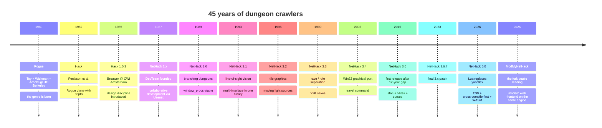

# A History of ModMyNetHack

This document traces the lineage of the codebase you're holding, from its origins in a UC Berkeley terminal lab in 1980 to the modernization work landing in this fork in 2026. It's written as a narrative — facts where they're load-bearing, but also the cultural texture that explains why a forty-five-year-old ASCII game still merits a modern web frontend in the first place.

If you only want to know what *this fork* has done, skip to "ModMyNetHack" near the bottom. If you want context for why anyone would invest the energy, the long version is the only honest answer.

## Lineage at a glance

The most striking thing about this timeline is how *long* the codebase has been continuously maintained. Most software written in 1987 doesn't run anymore. NetHack does — and on machines and operating systems that didn't exist when the code was written.

## Rogue (1980)

In 1980, three undergraduates at UC Berkeley — **Michael Toy**, **Glenn Wichman**, and later **Ken Arnold** — wrote a game called *Rogue: Exploring the Dungeons of Doom* on a VAX-11/780 running BSD UNIX. They had access to a curses library, an unlimited supply of text-mode terminals in the computer center, and a teaching schedule that left long evenings free.

Rogue's design contribution to game history was twofold. First: **procedural generation**. Every dungeon level was generated when the player descended to it, with rooms placed pseudo-randomly, corridors snaked between them, monsters and items scattered through. The player could not memorize a layout — every run was new. Second: **permadeath**. Death was final. There was no save-and-reload, no checkpoint, no resurrection. A run was a complete arc that ended in either victory (rare) or death (always, eventually).

Together those choices made every decision matter. The aesthetic — ASCII characters as monsters and items, a player represented by `@` (for "where you're at") — was not minimalist by intention. It was minimalist by *necessity*: a VT100 terminal had no other option. But what came of that necessity was an art form. A `D` was a dragon and a `d` was a dog and the player learned to read the world through symbol. The grid was 80 columns wide and 21 rows tall — the size of a standard VT100 screen with room for a status line and a message line — and that 80×21 became sacred. Forty-five years later, your browser still renders 80×21.

Rogue was widely shared on the BSD distributions and quickly spawned imitators. The genre name "roguelike" took hold within a decade.

## Hack (1982 → 1985)

In 1982, **Jay Fenlason**, with help from Kenny Woodland, Mike Thome, and Jonathan Payne, wrote a Rogue clone called *Hack* during a high-school computer-science class. Hack's first contribution was that it ran where Rogue didn't — initially on the Commodore PET, then ported widely. Its second contribution was scope: Hack added more monsters, more items, **shopkeepers** (who would chase you across the dungeon if you stiffed them), proper inventory categories (weapons, armor, scrolls, potions, wands, rings, …), and a much more elaborate combat system.

In 1985, **Andries Brouwer** of Stichting Mathematisch Centrum (CWI Amsterdam) released a substantially modified Hack with a proper design eye. Brouwer's Hack 1.0.3 introduced cursed and blessed items, identification mechanics, and the structural notion that some items were objectively useful while others were objectively cursed but indistinguishable until tested. It introduced the `?` command for help. It introduced the idea that an unidentified scroll might be a *scroll of fire* that would detonate everything flammable in your pack — and that the only way to know was to read it. Hack's shadow looms over every subsequent roguelike.

## NetHack (1987 → )

In 1987, a group of internet-connected developers — calling themselves **the NetHack DevTeam** — picked up Hack and began passing it around for collaborative improvement. The "Net" in NetHack denoted the development model, not a network feature. The original team (Mike Stephenson, Janet Walz, Don G. Kneller, Steve Creps, Eric Backus, and others) coordinated through Usenet, distributed patches by email, and released versions on a schedule that was determined entirely by when there were enough fixes to justify a release.

NetHack 1.3d was the first public release in July 1987. NetHack 2.x followed in 1988, NetHack 3.0 in July 1989. The `3.x` series is what most readers will know — a four-decade evolution of a single codebase that absorbed contributions from hundreds of developers without ever quite changing its character.

### NetHack 3.0 (1989)

The 3.0 series fully separated **role** (what your character does — Wizard, Valkyrie, Samurai) from **race** (what species — Human, Elf, Dwarf, Gnome, Orc) — though that complete separation came with 3.3 a decade later. 3.0 also introduced **branching dungeons**: not a single shaft from surface to bottom but a *graph* of paths. The Gnomish Mines branched off the main dungeon. The Quest opened around dungeon level 12 and demanded the player retrieve a class-specific artifact. Sokoban appeared as a logical-puzzle interlude. Gehennom — the lower realm where the player would eventually descend through Asmodeus, Baalzebub, Juiblex, Orcus to reach the Wizard — was implemented in the 3.0 line.

3.0's other big contribution was the **windowing abstraction**. The original Hack had assumed curses; NetHack 3.0 introduced `struct window_procs`, a vtable each interface port filled in. This is the same vtable the modernized frontend uses today — it's roughly thirty-five years old and has changed only in detail.

### NetHack 3.1 (1993)

Display rewrite using line-of-sight vision (the engine now knew which cells the player could see). The X11 interface arrived. Multi-level endgame implemented (the Astral Plane, the four elemental Planes). The multi-interface windowing system that 3.0 had drafted became real: a single binary could now support tty + X11 + Mac + Amiga + Atari simultaneously, selecting at runtime.

The 3.1 line also introduced **bones files** — when you died on a level, your corpse, your inventory, and your final message were written to a bones file that other adventurers might encounter on the same level later. (In a multi-user installation, this meant the dungeons were genuinely haunted by the dead.) Bones files persist in the codebase to this day; the BMP-fixture decoder in `frontend/scripts/buildTileManifest.ts` doesn't touch them but they're there.

### NetHack 3.2 (1996)

Tile-based graphical interfaces. Until 3.2, the X11 and Mac interfaces had rendered ASCII glyphs in proportional fonts. 3.2 introduced **tiles**: a pre-rendered 16×16 bitmap per glyph, loaded at startup and blitted to cells. The `win/share/` directory in this codebase — `bmptiles.c`, `gifread.c`, `tile.h`, the `monsters.txt`/`objects.txt`/`other.txt` descriptor files — is the same tile pipeline 3.2 introduced. It still works; the modernized frontend reads its BMP output and re-encodes it as PNG.

3.2 also introduced **moving light sources** beyond the player (e.g., NPCs carrying lit torches), foreshadowing the per-pixel torch flicker that lands in the modernized frontend's Phase 5B.

### NetHack 3.3 (1999)

The big race / role separation. 3.3 added Dwarves, Elves, Gnomes, Orcs as distinct races, removed the Elf as a class (it had been one in 3.2), introduced the Monk and Ranger classes, integrated some features from variant forks (NetHack-, NHplus, SLASH, Slash'EM). The Y2K fix in the score file went here too.

### NetHack 3.4 (2002)

Containerized sub-mechanics: shop damage repair, multiple shops, the **travel command** (mouse-clickable destination, or `_` from keyboard, that auto-routes the player along known corridors). A major Wizard quest revision. The Win32 graphical port, shepherded by Alex Kompel.

3.4.3, released in December 2003, became the de-facto stable release and stood for **twelve years** before the next official release. During that interval, variant forks proliferated — Slash'EM Extended, UnNetHack, dNetHack, GruntHack, FIQHack, EvilHack — each adding thousands of new monsters and items and mechanics, none of which made it back upstream. The 12-year gap was either a shame or a feature, depending on whom you ask.

### NetHack 3.6 (2015 → 2023)

The DevTeam returned in 2015 with NetHack 3.6, the first official release since 3.4.3. 3.6.0 absorbed many community-patch improvements (including ideas from the variants), introduced the **status hilites** (color-coded HP/Pw indicators when low or high), reworked role-class quest flavor, and added the curses interface as a bundled option.

3.6 had a long maintenance tail — 3.6.1, 3.6.2, 3.6.3, 3.6.4, 3.6.5, 3.6.6, 3.6.7 over the next eight years — fixing bugs, plugging buffer overflows, refining edge cases. Patch 7 (February 2023) was effectively the end of the 3.6 line.

### NetHack 5.0 (2026)

NetHack 5.0.0 released in May 2026 — the first .0 in over a decade and arguably the most architecturally ambitious release since 3.0. Its contributions:

1. **C99 baseline.** The codebase finally jettisoned the K&R-era compatibility scaffolding that 3.x had carried for the sake of dead compilers. (Some scaffolding remains — `tradstdc.h` still defines a few `VA_*` macros — but the structural commitment to C99 is real.)
2. **Lua replaces yacc/lex.** The build-time level compiler, dungeon compiler, and quest text processor — all written in yacc/lex — were replaced with **Lua** (5.4.8) processed at game-runtime. This means level designers can iterate without touching C; it also means the engine ships with a full Lua interpreter embedded.
3. **Cross-compile-first design.** The hints-file system in `sys/unix/hints/` was generalized to support cross-compile targets — MS-DOS via djgpp, Amiga via m68k cross-compiler, **WebAssembly via Emscripten**. The WASM path that ModMyNetHack's frontend depends on was added in 5.0.
4. **Stronger windowing abstraction.** New shim port (`win/shim/winshim.c`) marshals the entire `window_procs` interface into a single `(name, ret_ptr, fmt, args)` callback — the seam ModMyNetHack's frontend integrates against.

5.0 was the version that made a modern frontend *possible* without rewriting the engine. ModMyNetHack is what came of that opening.

## ModMyNetHack (2026 → )

ModMyNetHack started in May 2026 as a fork of NetHack 5.0.0 with a single goal: turn the world's longest-lived dungeon-crawler into something a person who has never opened a terminal would happily play in their browser.

The choice was deliberate. NetHack's reputation precedes it — opaque interface, vertical learning curve, decades of accumulated subsystems each with their own keystroke conventions. The traditional response to that reputation has been to write a tutorial mode, or a context-sensitive help system, or a "friendly" frontend that hides the keystrokes behind menus. ModMyNetHack's bet is that **the keystrokes aren't the problem**. The problem is that a black terminal screen with `@`, `D`, `d`, `$` glyphs makes the game look like a UNIX system administration tool, not a fantasy adventure. Show people a torchlit dungeon with bubbling lava and a dragon with idle animation and they will overlook the keystrokes. They'll learn `i` for inventory if you give them a reason to want to.

The technical thesis: do not rewrite the engine. Write a beautiful frontend on top of it. NetHack 5.0 gave us the seam. We use it.

### Modernization timeline

The work landed in concentrated bursts over several days in May 2026. What follows is a chronological log — useful as a contributor reference, not as a guide.

#### Phase 1 (2026-05-04) — The seam proof

- `sys/unix/hints/wasm.500` — top-level Emscripten cross-compile hints file
- `frontend/` directory scaffold (Vite + TypeScript)
- `frontend/src/shim/dispatcher.ts` — JS dispatcher for `winshim.c`'s callback marshaling
- `frontend/src/render/canvas2d.ts` — Phase 1 ASCII renderer
- `frontend/src/input/keyboard.ts` — input queue with vi-key arrow translation
- 14 unit tests covering glyph_info decoding, color resolution, keyboard plumbing

#### Phase 2 (2026-05-06) — WebGL2

- `frontend/src/render/webgl2.ts` — sprite-batched WebGL2 renderer with font-atlas ASCII fallback
- `frontend/scripts/buildTileManifest.ts` — placeholder atlas + manifest builder
- Vite build target configured

#### Phase 3 — Animation, modern menus, status HUD

- `frontend/src/render/animation.ts` — per-cell tween manager with per-monster idle phase offset
- `frontend/src/ui/menu.ts` — Canvas/DOM hybrid menu with letter-key accelerators and search filter
- `frontend/src/ui/status-hud.ts` — styled HUD with HP bar
- `frontend/src/ui/prompts.ts` — yn / getlin / display-file modals
- Window-proc handlers wired to use the new components (no more auto-cancel on menus)

#### Phase 4 — Camera, particles, FOV scaffolding

- `frontend/src/render/camera.ts` — tween-capable camera framework
- `frontend/src/render/particles.ts` — typed-array pooled emitter (1024 capacity)
- `frontend/src/render/fov.ts` + `frontend/src/render/shaders/fov.ts`

#### Phase 5B — Post-process pipeline + animated terrain

- `frontend/src/render/postprocess.ts` — bloom + vignette + color-grade + optional CRT
- `frontend/src/render/shaders/{postprocess,terrain}.ts` — water, lava, torch flicker, altar pillar-of-light, weather rain
- `frontend/src/render/level-meta.ts` — branch tagging + per-branch visual style table

#### Phase 5C — Cinematic flourishes

- `frontend/src/effects/floating-text.ts` — damage / heal / level-up text with regex-based message parser
- `frontend/src/effects/status-flourishes.ts` — low-HP pulse, hunger desaturation, confused wobble, hallucinations
- `frontend/src/effects/item-aura.ts` — gold/violet/cyan aura overlays
- `frontend/src/render/parallax.ts` — parallax depth for tall objects

#### Phase 5D — Bookend screens

- `frontend/src/screens/state-machine.ts`
- `frontend/src/screens/{title,death,victory,settings}.ts`

#### Phase 5E — Ambient soundscape

- `frontend/src/audio/soundscape.ts` — Web Audio crossfading bed manager + heartbeat layer

#### Phase 5F — Settings, accessibility, performance

- `frontend/src/screens/settings.ts` — full settings UI persisted to localStorage
- `frontend/src/accessibility/{screen-reader,colorblind,reduced-motion,perf-monitor}.ts`

#### Engine track (interleaved with frontend phases)

- `test/headless/drive.c` + scripted scenarios + `make check-headless` target
- `sys/libnh/libnhmain.c` — `EM_JS` read-only state export for `u.uhp`/`u.uhpmax`/`u.uhunger`/`u.uz.dnum`/etc.
- `.github/workflows/frontend.yml` — typecheck + build + unit tests + WASM cross-compile + headless harness + Playwright smoke

#### Track C — engine cleanup (later 2026-05-06)

- **`g_win` migration in-place.** `WIN_MESSAGE`/`WIN_STATUS`/`WIN_MAP`/`WIN_INVEN` consolidated into `struct win_globals g_win` with `#define` shims. Three vestigial extern declarations cleaned up across `wintty.c`, `mhmain.c`, `mswproc.c`. Verified by full Linux `make all`.
- **`g_term` / `g_classes` cleanup.** Discovered upstream had already moved the targets into other structs (`gt`, `gs`, `gp`, `gr`, `svt`); removed the vestigial standalone externs in `decl.h` and fixed one bug at `dungeon.c:164,223` where the code referenced the now-removed `tune` global instead of `svt.tune`.
- **Dead-platform retirement.** Deleted `outdated/`, `sys/{amiga,msdos,vms}/`, six `sys/share/*.c` PC/Atari files, four orphan headers (`amiconf.h`, `micro.h`, `pcconf.h`, `vmsconf.h`). About 5 MB of code gone. `azure-pipelines.yml` matrix entry for MS-DOS dropped.
- **Regex consolidation.** `sys/share/pmatchregex.c` deleted (was the fallback for platforms without POSIX regex). POSIX on Unix, C++11 `<regex>` on Windows.
- **BMP→PNG conversion.** `frontend/scripts/buildTileManifest.ts` rewritten with a real BMP decoder (BITMAPINFOHEADER variant, 8/24/32-bit RGB, stride-padded row reads) and a hand-rolled uncompressed-DEFLATE PNG encoder. 6 new unit tests.
- **Render-to-FBO + post-process composite.** `webgl2.ts` gained `setRenderTarget` + `onAfterRender`. The MapRenderer now draws into the post-process pipeline's scene FBO; the pipeline composites bloom + color-grade + vignette + optional CRT to the screen. Settings live-update.

#### Phase 6 — User-facing documentation (current)

- `README.md` — project front door, GitHub-rendered.
- `docs/HISTORY.md` — this file.
- `docs/VISUAL_DESIGN.md` — per-system explanation of the visual / audio aesthetic.
- `docs/LORE.md` — both the world of Yendor and the technical lore.

### Verification across all of the above

- 59 unit tests pass via `vitest run`.
- `npx tsc --noEmit` clean across the frontend.
- `npx vite build` produces a 86 KB / 26 KB-gzipped bundle.
- Engine: `make all` on Linux produces `src/nethack` (12 MB ELF64) without warnings.
- Engine: `make WANT_LIBNH=1 all` produces the static library the headless harness links against.

## What's still ahead

The plan documented at `/root/.claude/plans/modernize-this-code-base-goofy-creek.md` enumerates everything still to land. The largest items:

- **Phase 5A's commissioned 64×64 monster atlas** (~370 monsters × 4 frames). 2–3 month art lead time. The frontend's atlas loader is ready; the art slot is empty.
- **Phase 5E's CC0 audio beds.** Ten environmental tracks need to be sourced from freesound.org. The audio engine plays silence today and will play real audio the moment the OGG files land in `frontend/public/sounds/ambient/`.
- **The `g_player` globals migration.** The `u*` weapon/armor pointer set is ~20 names referenced across hundreds of files. The mechanical recipe is the same as `g_win`'s; the blast radius is much larger.
- **The `#ifdef AMIGA|MSDOS|OS2|TOS|VMS|MACOS9` block sweep.** The platforms are gone but the conditional blocks remain as dead source. About 100 files. Mechanical with `unifdef`.

For the canonical list with priorities and blockers, see [`DEVEL/MODERNIZATION.md`](../DEVEL/MODERNIZATION.md).

---

NetHack endures because every generation of programmers who encounter it discovers something worth preserving. ModMyNetHack is one such response. The dungeon hasn't changed — but the way you see it has.
