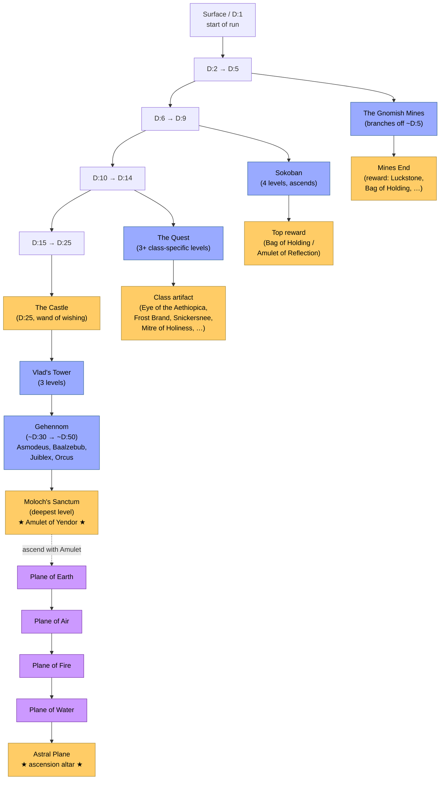
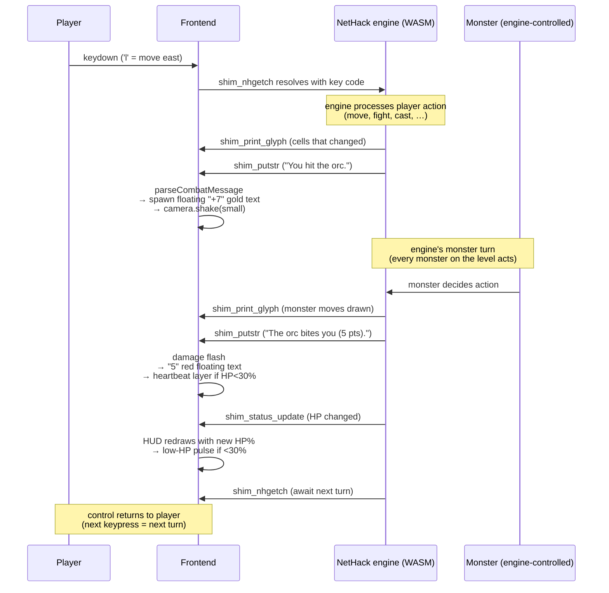

# Lore

This document is in two halves. The first is the **lore of the world** — the in-game mythology that drives every NetHack run, written so a new player knows what the Amulet is and why the dungeon has gods. The second is the **lore of the project** — the technical decisions that shaped this fork, written so a future contributor knows why we did what we did.

The two are related. NetHack's mythology has been remarkably stable since 1989; the technical commitments in this fork are deliberate exercises in respecting that stability. Reading both halves should leave you with a clear answer to two questions: *what kind of game is this*, and *why does the code look the way it does*.

---

# Part I: The World of Yendor

## The setup

You are an adventurer. You have come to a remote spot — variously a temple, a dungeon entrance, a hole in the ground depending on your role — bearing equipment you can name and a quest you have undertaken. The **Amulet of Yendor**, a powerful artifact stolen by a sorcerer named Rodney long ago and kept in his private dungeon ever since, must be retrieved. To do this you must descend into the **Dungeons of Doom**, find the Amulet, ascend back out, and present it to your god on the Astral Plane.

This is the entire plot. NetHack has not added a new plot point since 1987. The depth that emerges is from how every sub-system interacts with every other sub-system, not from narrative.

## The Amulet of Yendor

The Amulet is the macguffin. It does not inherently grant you power; it simply must be brought from the bottom of the dungeon (level ~50) up through the dungeon, through Gehennom, and finally up into the Endgame. The journey is the gameplay.

When the Amulet is with you, certain things happen: levels you've left are *not* preserved (you can't backtrack to safety); demons are aware of you; the Wizard of Yendor (Rodney himself, the original thief) actively pursues you. Your run becomes a chase.

There are also **Imitator Amulets** scattered throughout the dungeon — fakes designed to confuse you. The real one is at a specific location guarded by the Wizard.

## The Dungeons of Doom

The dungeon is a graph of branches, not a single shaft. The structure has been stable since NetHack 3.0:



The two-phase shape is the deep structure: descend to the Amulet (the dungeon proper, ~50 levels), then ascend through the elemental planes to your god's altar on the Astral Plane. The Vault is hidden somewhere in the early dungeon — it doesn't appear on the graph because finding it is a small puzzle in itself.

### Main shaft (levels 1–~28)

The default downward path. Dungeon levels 1–4 are surface-adjacent — a tutorial in everything but name. Levels 5–10 contain the **Mines branch entry**. Level 6–7 contains the **Sokoban branch entry** (going *up* — Sokoban ascends). Levels 9–14 contain the **Quest branch entry**. Around level 25 is **the Castle**, a fortress with valuable artifacts and a wand of wishing if you can solve its puzzle. Level ~28 is the **Vlad's Tower entry** and just below that is the entry to **Gehennom**.

### The Gnomish Mines (~level 5 → ~level 13)

Gnomes and dwarves dwell here, with a friendly orientation toward your character if you're a Dwarf, hostile otherwise. The Mines bottom out at **Mine Town** (a friendly village with shops and a temple) and then continue past it to **Mines End**, where lurks one or another reward — sometimes a Luckstone, sometimes a Bag of Holding, sometimes nothing.

### Sokoban (4 levels, going up)

A puzzle interlude. Each level is a static box-pushing puzzle (Sokoban itself, the 1982 puzzle game, in the dungeon). Solving them grants either a Bag of Holding or an Amulet of Reflection at the top. Pushing boxes off cliffs or onto monsters is permitted but counts as a luck-disturbing transgression.

### The Vault

A small treasure room hidden somewhere in the early dungeon, full of gold piles guarded by a guard who will demand to know your name and either let you out (if you cooperate) or fight you (if you don't). The Vault's discoverability is a small puzzle in itself — it doesn't connect to the rest of the level by normal corridor.

### The Quest (3+ levels)

A class-specific dungeon. Each role (Wizard, Valkyrie, Samurai, …) has its own Quest with its own NPC quest-giver, its own monsters, and its own class-specific artifact at the bottom. Returning the artifact to the quest-giver completes the quest and unlocks bonuses. Quest narratives differ by role:

- The **Wizard's** quest hunts the Eye of the Aethiopica
- The **Valkyrie's** quest finds Frost Brand
- The **Samurai's** quest recovers Snickersnee
- The **Priest's** quest reclaims the Mitre of Holiness

…and so on for all 14 roles. The lore in `dat/data.base` (the in-game encyclopedia) gives flavor for each.

### Vlad's Tower (3 levels)

Vlad the Impaler's tower, near the dungeon's bottom. Vlad himself is here with the Candelabrum of Invocation — needed for the Endgame.

### Gehennom (~level 30 → ~level 50)

The lower realm. A maze of red corridors, populated by demons and undead. The Wizard of Yendor lives somewhere in Gehennom. The four **Demon Princes** — Asmodeus, Baalzebub, Juiblex, Orcus — each inhabit their own level. Below them all, deeper still, is **Moloch's Sanctum**, the lowest dungeon level, where the Amulet of Yendor itself rests.

The Sanctum is locked behind the **Vibrating Square** — a single tile that vibrates (the engine literally renders it as a different glyph) and won't permit passage until the player has solved a small ritual. ModMyNetHack's cinematic camera triggers a zoom on the Vibrating Square when it's first revealed.

### The Endgame: the Planes

After retrieving the Amulet, the player ascends back to the dungeon entrance (level 1), then continues *up* into a sequence of elemental planes:

1. **Plane of Earth** — narrow stone passages
2. **Plane of Air** — open sky with floating platforms
3. **Plane of Fire** — molten lakes
4. **Plane of Water** — ocean swells
5. **Astral Plane** — the final destination

Each plane has its own monsters, its own visual register. ModMyNetHack's level-meta system tags them as `outdoor` for weather + faux time-of-day shaders.

### The Astral Plane

The summit. Three altars (Lawful, Neutral, Chaotic) attended by demigods of the three alignments. The player must offer the Amulet on the altar of *their own* alignment. Doing so triggers ascension — the win condition, vanishingly rare in NetHack play.

## The Pantheon

NetHack's gods are role-specific. Each role has three gods (Lawful, Neutral, Chaotic) drawn from real-world mythology, often in evocative juxtapositions. The Wizard worships Ptah (Egyptian) / Thoth / Anhur. The Valkyrie worships Tyr (Norse) / Odin / Loki. The Samurai worships Amaterasu Omikami (Japanese) / Raijin / Susanowo. The Priest worships per-deity and so cycles through the entire pantheon depending on alignment.

Your god is your audience. Praying to your god (when not spamming) can fix various calamities — heal critical wounds, cure starvation, unbless a cursed weapon. Prayer has a cooldown (`u.uluck` and `gm.prayer_timeout`) and abusing it angers your god, who becomes hostile and can strike you with lightning. The relationship is transactional but textured.

When you ascend, you offer the Amulet to *your own god's* altar. Offering on the wrong-alignment altar produces a cosmic disaster.

## The Wizard of Yendor (Rodney)

The antagonist. Rodney stole the Amulet long ago; the Amulet is in his private dungeon (Moloch's Sanctum); when you take it, he begins to hunt you. Rodney can teleport, polymorph, summon undead, raise the dead. He carries his own copy of NetHack's most dangerous wand. Killing him is rare; outrunning him to ascension is the more typical resolution.

Rodney also has a reputation in NetHack culture for being the random-events villain — when something inexplicably terrible happens (a bones level loaded into a normal dungeon, an unlucky scroll outcome, a critical save corruption), the player blames Rodney.

## Bones and ghosts

When you die — and you will die, dozens of times — the engine writes a **bones file** for the level you died on. Your corpse, your gear, and your final message are saved. Some days later, when *another* adventurer (the same player on a new run, or another player in a multi-user installation) reaches that level, the bones file is loaded. Your previous incarnation's corpse is on the floor; your gear is scattered nearby; your ghost lurks somewhere on the level. Killing the ghost recovers your gear (and the ghost's loot from when *they* died).

The dungeons are genuinely haunted by your past failures. ModMyNetHack preserves bones intact — it's one of the oldest and most beloved features.

## Permadeath

You get one life. There is no save-and-reload to undo a bad decision. Save files exist (you can quit the game and resume later) but the moment you die, the save is destroyed. Some players go decades without ascending. Some never do. The game does not care.

## The turn loop

Every player action — a step, a swing of a sword, a sip from a potion — advances *one game turn*. The engine processes it deterministically: your action first, then every monster on the level acts, then status effects tick. The frontend's job is to make all of that legible.



This is the real-time-experience layer the frontend adds: the *engine* still thinks in atomic, deterministic turns, but the *player* sees damage numbers float, watches the camera pan to off-screen events, hears the ambient bed cross-fade as they descend a staircase. Nothing about the game's logic changes; everything about how it feels to play does.

## Conduct

Optional self-imposed restrictions tracked by the engine: *vegetarian* (never eat a corpse), *atheist* (never pray), *foodless* (never eat anything), *zen* (never see your own character glyph), *illiterate* (never read), *pacifist* (never kill), and many more. Successful ascension while maintaining a conduct is a separate achievement. Players talk about "vegetarian Samurai ascensions" the way mountaineers talk about no-oxygen Everest summits.

---

# Part II: The Lore of This Fork

If Part I is what NetHack *is*, Part II is why ModMyNetHack made the choices it made. Each section is a design decision and the reasoning behind it.

## Why the libnh + winshim seam

NetHack 3.0 (1989) introduced `struct window_procs` — a vtable each interface port (tty, X11, Mac, Amiga, …) fills in. Forty-five years later, that vtable is ModMyNetHack's integration point. Every callback the frontend implements — `print_glyph`, `nhgetch`, `start_menu`, `select_menu`, `getlin`, all 30+ of them — was already present in the 3.0 design.

NetHack 5.0 added one more thing: `win/shim/winshim.c`. The shim is itself a window port that doesn't render anything; instead it marshals every callback into `(name, ret_ptr, fmt, args)` and forwards to a host-provided callback. Under WebAssembly, that host callback is a JS function registered by name in `globalThis`.

This means **the entire NetHack engine runs unchanged**. The shim sits between the engine and the frontend. The frontend implements ~30 JS handlers, one per shim function, and the engine speaks to them through the marshaling protocol. We didn't have to fork the engine; we didn't have to add a new `wp_id` (other than `wp_shim`, which already existed in 5.0); we didn't have to break save-file compatibility. The bridge was *already there*.

This is the single best decision the upstream DevTeam ever made for downstream modernizers. If the `window_procs` abstraction had been less complete — if it had been just "call this for each cell, call that for each menu" — we would have had to write our own port from scratch. Instead, every NetHack subsystem (combat, magic, item identification, prayer, the Vault, the bones files, *everything*) routes its UI through `window_procs` and we get them all for free.

## Why 80×21 is sacred

The map is 80 columns wide and 21 rows tall. It has been since 1980. It will remain so.

Two reasons. First, **forty years of muscle memory**: every NetHack player, on every variant, on every interface, expects the map to be 80×21. Changing it would invalidate every YouTube tutorial, every wiki page describing room layouts, every speedrun split. Some of those resources are older than many of the maintainers.

Second, and more subtly, **the level generator is calibrated to 80×21**. The algorithms in `src/mklev.c` and `src/mkmaze.c` produce dungeon levels that fit within those bounds and use them well — neither sparse nor cramped. Resizing the map would not just change pixels; it would change the *texture* of how the dungeon plays. A 120×40 dungeon is a different game.

ModMyNetHack's renderer makes the 80×21 cells look beautiful. It does not make them go away.

## Why 64×64 sprites

The first big sprite-size question: 32 vs. 48 vs. 64. The arguments:

**32×32** — the lightweight option. Fits a lot of monsters into a single atlas page. Reads as obviously a sprite-tile. Fits comfortably on a 1080p screen at 80×21. **But** at 32×32 a sprite has roughly 1024 pixels to convey identity, color, and animation, and that's not enough for a dragon-with-fire-breath to look meaningfully better than `D:` text. 32×32 is the *Caves of Qud* register.

**48×48** — the middle ground. ~2300 pixels per sprite. Enough to convey animation frames distinctly. Comfortable on 1440p; a stretch on 1080p. **But** 48×48 doesn't have a strong cultural register; it's neither the classic 16×16 retro nor the chunky modern-pixel 64×64. It looks unidentifiable as a stylistic choice.

**64×64** — the chosen option. ~4100 pixels per sprite. The *Stoneshard* register. Enough detail for hand-shading, idle animation that reads, and meaningful per-element status differentiation (a fire dragon vs. a frost dragon at 64×64 looks unmistakably different at a glance). Requires 80×21×64×64 = ~7 MB of pixels per fully-visible map, fits comfortably in a 4096×4096 atlas page.

The tradeoff is screen real estate: at 64×64 a fully visible map is 5120×1344 pixels of viewport. On 1080p displays this overflows; the renderer either scales down (losing detail), shows a viewport with smooth-scroll (preserving detail), or uses smart-zoom that adapts to screen. We chose smooth-scroll camera-follow as the default, with settings to override.

## Why ambient-only audio

The single most controversial design choice. NetHack has never had audio in its primary distribution. Adding music or event SFX would be a radical change. Three reasons we limit ourselves to ambient soundscape:

**Music puts a clock on contemplation.** NetHack is a thinking game. Players read scrolls carefully, evaluate their identification of an unknown wand, plan a tactical retreat across multiple turns. A 30-second repeating combat loop tells the player *hurry up*. A 60-second exploration theme that loops every minute makes the player aware of time passing in a way that disturbs careful play. Ambient soundscape — a cave drip, a distant wind, a crackling fire — sets a mood without imposing a tempo.

**Event SFX gild lilies.** A combat hit in a real-time game (Dark Souls, Hades) needs SFX to communicate the hit *fast*, before the visual feedback can finish. NetHack is turn-based; the player has all the time in the world to read the message line. Adding "hit-confirm chimes" to a turn-based game is the audio equivalent of adding a "click here" button to text on a website — solving a problem the medium doesn't have.

**Untrained sound design ages badly.** Music and SFX require a composer / sound designer with skill and taste. Both are scarce; both are expensive; both leave fingerprints that age poorly when the underlying game outlives the score. Ambient beds, by contrast, are largely interchangeable — a forest-drip from 2005 and one from 2025 sound roughly identical, and the project doesn't get tied to a specific composer's career arc.

We may revisit a *select* set of event SFX (item pickup, level transition, ascension fanfare) for a future phase. Not now.

## Why no save-format migration

NetHack's save files are binary, structured by the **structfield (`sf*`) framework** in `src/save.c` / `src/restore.c` / `src/sfbase.c` / `src/sfstruct.c`. Each saved field is written by macro-generated code that knows the type of every member of every persisted struct. There is no schema; the format depends entirely on the C struct layouts at compile time.

Migrating to a schema-aware format (JSON, MessagePack, FlatBuffers) would have advantages: easier to debug, easier to migrate across versions, easier to inspect outside the engine. But:

1. **Forty years of saves exist**. Old NetHack 3.6 saves are loadable by 5.0 with `EDITLEVEL` compatibility. A format migration breaks every existing save.
2. **The structfield framework is the engine's source of truth for what's persistent**. Changing the format means rewriting 4500 lines of structured serialization code.
3. **The benefits don't accrue to anyone**. The engine doesn't care about cross-language readability. The player doesn't care what the bytes look like. The frontend doesn't read save files (they're persisted in IndexedDB by the WASM build's IDBFS).

Cloud-save-sync, if ever wanted, can serialize the opaque blob without understanding it. The structfield format isn't broken; we leave it.

## Why the globals migration is incremental

NetHack's `decl.h` declares ~92 module-scope globals. Most have been migrated by upstream into letter-suffixed instance structs (`ga`, `gb`, …, `gt`) over the last decade. The remaining ~40 loose globals are migration candidates.

The naive approach: one PR migrates all 40 into a `g_*` struct family. Done. But:

1. **Blast radius.** Every file that references one of those 40 names — and that's most of the engine — needs to either get a `#define` shim or update its references. A single PR touches hundreds of files.
2. **Verification across platforms.** The engine targets Linux, macOS, Windows, and historically (pre-this-fork) several extinct platforms. A single PR that migrates 40 globals can't be verified on all platforms simultaneously without parallel CI infrastructure.
3. **Bisection legibility.** If a migration introduces a regression, having one big migration PR makes it impossible to bisect to a specific group. Smaller PRs (one per group) keep the regression net working.

So we migrate in groups: `g_win` first (4 names, low risk, smallest possible blast radius), `g_term` and `g_classes` next (turned out to be already-migrated by upstream, just had vestigial externs to clean up), and `g_player` (the big `u*` set, ~20 names) last. Each group is one PR. Each PR is independently reviewable, independently revertible, independently verifiable.

The tradeoff: the project carries the half-migrated state for a longer period. We accept that. A safe slow migration is preferable to a fast unverified one.

## Why we kept tradstdc.h

`include/tradstdc.h` is 583 lines of pre-ANSI K&R compatibility scaffolding. Most of it is dead — it talks about NOVOID, `__TURBOC__`, ULTRIX `__LANGUAGE_C` detection, and other concerns from compilers extinct for decades.

But: among the 583 lines are **VA_DECL**, **VA_INIT**, **VA_NEXT**, **VA_ARGS**, **VA_START**, **VA_END**, and **VA_PASS1** macros. These are *live*. `src/end.c` declares its `panic()` function with `panic VA_DECL(const char *, str)` and uses `VA_INIT`/`VA_ARGS`/`VA_END` in the body. Several other files do the same.

A clean replacement would mean rewriting those declarations to use straight `<stdarg.h>` — `void panic(const char *str, ...)` with `va_list ap; va_start(ap, str); ...; va_end(ap);`. Maybe a dozen call sites. Mechanical but real work.

For now, `tradstdc.h` stays. Its dead K&R scaffolding is harmless — modern compilers evaluate the relevant `#ifdef`s as false and skip the whole branch. The live `VA_*` macros work. Dead code is cheap; rewriting twelve `panic`-style call sites is cheaper as a focused follow-up than as a side-effect of dead-platform removal.

## Why we deleted Amiga and MS-DOS but kept Windows

Amiga, MS-DOS, and OpenVMS were dead-platform candidates because:

- **Their toolchains are extinct.** No modern CI runs an AmigaOS or DOS binary. Bochs and DOSBox can simulate, but not test in production.
- **Their playerbases are tiny.** A handful of retro-computing enthusiasts run NetHack on Amigas; the cross-compile target supported them. Removing the cross-compile target doesn't prevent those players from running 3.6 or earlier — it just means they don't get 5.0.
- **Their code was a maintenance burden.** Every change to platform-independent code had to consider the Amiga port; every fix to a buffer-handling bug had to be tested against MSDOS-specific quirks.

The cost of supporting them was a constant tax on every other contributor.

Windows is different. Windows is alive, it's where the largest NetHack-curious userbase is, and the codebase has been actively maintained on it for decades. Modern Windows builds work via VS2022 and MSYS2; no extinct toolchain involved. We kept the Windows port and its `sys/windows/` directory unchanged.

The line is: **does anyone with a modern OS run this?** Yes for Windows; no for Amiga / MSDOS / VMS.

## Why the 1/f-noise torch flicker

A static "warm yellow" tile is recognizably a torch. A torch with simple sine-wave brightness modulation is more recognizably a torch. A torch with **1/f-noise modulation** is *unmistakably* a flame.

1/f noise (sometimes called "pink noise") is the spectral signature of natural, unpredictable processes: candle flames, flowing water, river currents, rustling leaves, heart rate variability. Sine waves modulated at one frequency look mechanical (the eye locks onto the rhythm); 1/f noise is "lumpy" at every frequency simultaneously, and the eye reads that as natural movement.

The implementation is four sines stacked at increasing frequencies and decreasing amplitudes:

```glsl
float pinkNoise(float t, float seed) {
    return (sin(t * 6.1 + seed * 3.0)
          + sin(t * 13.7 + seed * 7.0) * 0.5
          + sin(t * 27.3 + seed * 11.0) * 0.25
          + sin(t * 51.1 + seed * 17.0) * 0.125) / 1.875;
}
```

Each torch's `seed` is unique (derived from cell position), so a corridor of torches doesn't all flicker in unison. The output multiplies into the FOV alpha, so the *darkness* of dim corridors breathes as much as the torch sprite does. This is the difference between a cartoonishly-lit dungeon and one that feels physically present.

The same trick is used by Stoneshard, by Caves of Qud, and by every contemporary game with believable lighting. It's a one-page shader; it's free; it transforms the game's mood.

## Why we picked WebGL2 over Canvas2D

Canvas2D would have been simpler. The Phase 1 renderer was Canvas2D. It worked.

WebGL2 became necessary for Phase 5B's post-processing. Bloom, color-grade LUTs, vignette, optional CRT — all are fragment shaders. Canvas2D has no notion of fragment shaders. To get any post-processing in Canvas2D, you'd be reading the canvas pixel buffer back to a `Uint8ClampedArray`, processing it on the CPU, and re-blitting — at full resolution, that's a multi-millisecond per-frame cost that destroys the 60 fps target.

WebGL2 also gave us:

- **Instanced rendering** for sprite batching. 80×21 sprites in one draw call, not 1680.
- **Render-to-texture** for the post-process pipeline (you can't easily render Canvas2D into another Canvas2D with a shader pass between).
- **Native shader access** for the per-pixel FOV, the torch flicker, the water shimmer, the lava bubble.

WebGL2 is the only modern path that gets us where we want to be. It works on every modern browser (Chrome, Firefox, Safari, Edge — all support WebGL2). The only cost is the renderer is more code; that cost is paid once.

## Why no procedural sprite generation

There are tools that generate sprites algorithmically — pixelart.dev, Bfxr's visual cousins, neural networks trained on pixel art. Procedural generation is tempting because it scales infinitely and costs nothing per sprite.

But: **procedural sprites have no character**. Every dragon looks like every other dragon (because they all came from the same generator with parameters tweaked). NetHack has 370+ monster types, each with decades of player-relationship texture — the floating eye that paralyzes you, the grid bug that's contemptibly easy, the cockatrice that turns you to stone if you touch it. Each monster is a distinct *cultural* entity in NetHack culture, and each deserves an individually-authored visual identity.

We also rule out **AI-generated sprites without disclosure**. If a future contributor wants to use an AI tool to draft a sprite, they should be transparent about it in the asset's `CREDITS.md` entry. We're not banning the tools; we're requiring the audit trail. Visual coherence demands editorial judgment, and editorial judgment requires knowing where each piece came from.

## Why the headless test harness is the keystone

The single most important piece of infrastructure shipped this fork is `test/headless/drive.c`. It's a small C program — 250 lines — that links against `libnh.a`, registers a window-proc callback, replays scripted keystrokes from a text file, and asserts on the sequence of callbacks the engine made.

It is 1000× faster than a Puppeteer browser smoke test. It runs in seconds. It produces clear failure messages. It catches engine-side regressions before they touch the frontend, before they touch CI, before they touch users.

The plan calls it the keystone, and that wasn't hyperbole. Every engineering change in this fork — the globals migration, the dead-platform removal, the regex consolidation — was implicitly verified by `make all` continuing to work, but *explicitly* protected by the headless harness's ability to catch behavioral regressions. When someone breaks `print_glyph` or accidentally changes the meaning of `nh_poskey`, the harness catches it before lunch.

If you contribute to this fork and you don't add a headless scenario for the bug you fixed or the feature you added, you've half-finished your work.

## Why this README is shaped this way

The original NetHack 5.0.0 README is 155 lines of plaintext describing how to build the game, how to contact the DevTeam, what platforms it supports, and the licensing terms. It's exactly the README a 1990s open-source project ships.

ModMyNetHack's README.md is shaped differently — bullet lists, a table of contents, GitHub-rendered headings, links to focused docs. It is a 2025 project's front door. Both READMEs are correct for their era and their purpose. We keep both.

The discipline is that README.md is a *front door*, not an *encyclopedia*. It has 5 minutes of the reader's attention. If they want more, the focused docs are linked. If a reader wants to know how to build, README.md sends them to `frontend/README.md`. If they want history, to `docs/HISTORY.md`. If they want lore (the document you are reading), to `docs/LORE.md`. The hub-and-spokes structure scales as the project grows; a single 5000-line README does not.

---

## Closing thought

NetHack is a forty-five-year-old game. Most of its fascinating properties are emergent from interactions between subsystems that no one designed to interact. The dungeon, the gods, the Wizard, the Amulet — these are not features bolted onto a platform; they are *the platform*.

ModMyNetHack's job is to dress that platform in clothes worth wearing. We render torches with believable flicker; we color-grade per dungeon branch; we play soft cave-drip ambient at the bottom of the Mines. We do not change the orcs, the shopkeepers, or the seventeen ways your hero can die in a single turn.

If we've done this right, you should finish reading this document and want to play. The game is the same one your parents played in 1989. The way you'll see it is new.

The Amulet is at the bottom. Good luck.
