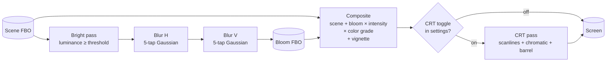
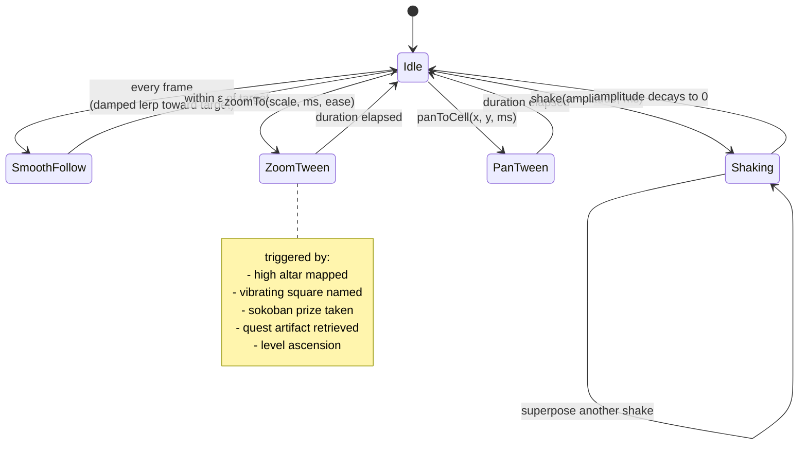
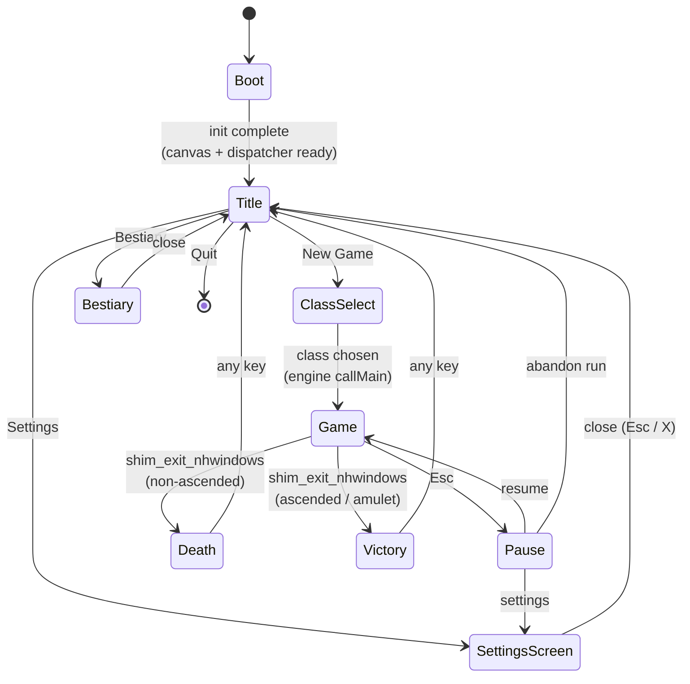
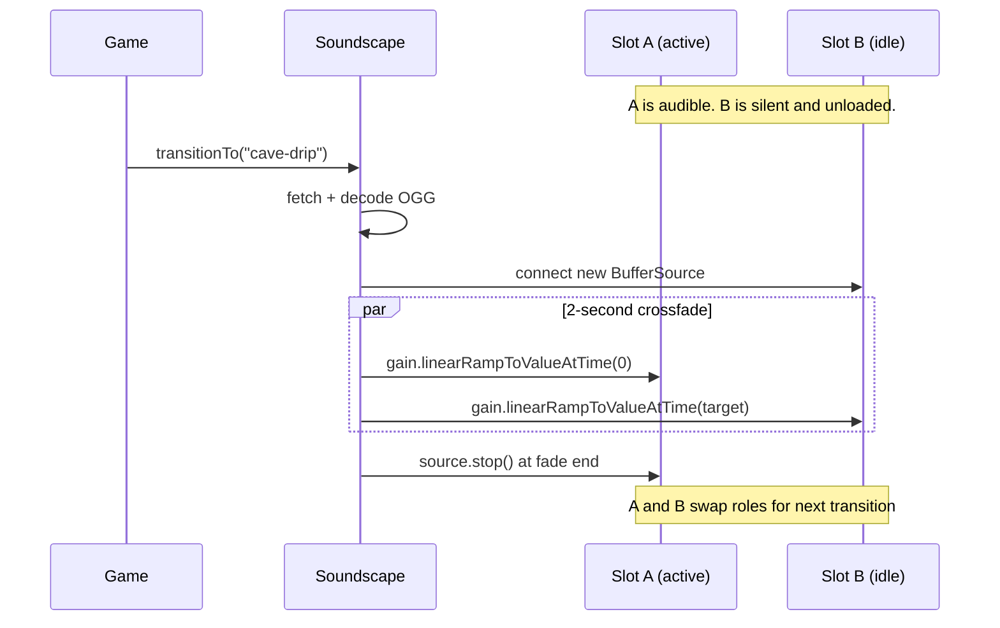

# Visual Design

This document explains, system by system, how ModMyNetHack looks the way it does. Each section describes the *what* (what the player sees), the *why* (the design intent), the *where* (where the code lives), and the *how* (key technical choices). It's written for two audiences: a contributor who wants to extend a particular subsystem, and a curious reader who wants to know what was actually built.

If you're new to the project, skim the table of contents. The early sections (Aesthetic register, Map renderer, Animated terrain) explain the bedrock; later sections (Cinematic camera, Particles, Status flourishes) build on that bedrock.

## Table of contents

1. [Aesthetic register](#aesthetic-register)
2. [Reference points](#reference-points)
3. [The map renderer](#the-map-renderer)
4. [Animated terrain](#animated-terrain)
5. [Field of view and lighting](#field-of-view-and-lighting)
6. [Post-process pipeline](#post-process-pipeline)
7. [Cinematic camera](#cinematic-camera)
8. [Parallax depth](#parallax-depth)
9. [Particle systems](#particle-systems)
10. [Floating combat text](#floating-combat-text)
11. [Status flourishes](#status-flourishes)
12. [Item aura glow](#item-aura-glow)
13. [UI typography and menus](#ui-typography-and-menus)
14. [Bookend screens](#bookend-screens)
15. [Audio aesthetic](#audio-aesthetic)
16. [Accessibility as visual design](#accessibility-as-visual-design)
17. [Performance budget](#performance-budget)
18. [Adding new visual content](#adding-new-visual-content)

---

## Aesthetic register

ModMyNetHack's target register is **high-fidelity pixel art, modern retro**. The frame of reference is roughly 2015–2024 indie roguelikes — a generation that took the 1980s ASCII-and-tile aesthetic seriously, refined it with shaders and post-processing, and arrived at something that feels both nostalgic and contemporary.

What this register asks of every visual decision:

- **Sprites are pixel art**, not vector. 64×64 is the target tile size. Sprites are hand-authored or hand-retouched; nothing AI-generated, nothing procedural beyond color tinting.
- **Animation is sub-pixel where appropriate.** Idle loops are typically 2 frames at 8–12 fps. Attack animations are 3–4 frames. Hurt-flashes are a single 80 ms frame.
- **Color palettes are limited but rich** — the goal isn't dithered 16-color ZX Spectrum, nor 256-color VGA, but something between: 32 colors per atlas page, deliberately picked for harmony and tonal contrast.
- **Effects are post-processed**, not painted into sprites. A torch tile is a torch sprite plus an additive halo plus a 1/f-noise modulation of the ambient FOV alpha. Editing the torch color means editing one shader uniform, not redrawing 4 frames.
- **The dungeon breathes.** Static rendering is unacceptable. Even an empty corridor has flickering torches and shimmering water if either is in view.

What the register *avoids*:

- **Fully-rendered 3D.** No depth buffer, no perspective camera. WebGL2 is used purely for 2D sprites and post-process passes.
- **Procedurally generated sprites.** Every tile is authored.
- **Photorealism.** Pixel art's strength is symbolic clarity. A 64×64 fire-breathing red dragon should read as a fire-breathing red dragon at a glance, not approximate one.
- **Minimalism for its own sake.** Cogmind's monochrome HUD is beautiful but not the right register here — ModMyNetHack should feel like a place, not a system.

## Reference points

The closest contemporary references — what we borrow and what we don't:

**Caves of Qud (Freehold Games, 2015 →).** The lodestar. Hand-authored 16×16 pixel art, post-processing for lighting and weather, a UI that takes typography seriously, and an accessibility settings page that takes color-blindness and reduced-motion as first-class concerns. ModMyNetHack borrows: per-cell idle phase offset (so adjacent monsters don't breathe in lockstep), the "settings as a real screen" treatment, the layered ambient audio. ModMyNetHack does *not* borrow Qud's text-density UI — NetHack has its own message conventions and fights to preserve them.

**Stoneshard (Ink Stains Games, 2020 →).** The lighting reference. Stoneshard's torchlit dungeons read as physically present in a way few roguelikes manage. The trick is per-pixel light propagation (not per-cell tinting) plus 1/f-noise flicker on flame-light sources. Phase 5B replicates both.

**Songs of Conquest (Lavapotion, 2024).** Color-grade reference. Each region of the world has its own color treatment via LUT — a trick borrowed from cinema. ModMyNetHack does the same per dungeon branch: cool blue on D:1–3, warm gold in the Mines, sickly red-green in Gehennom, ethereal violet on the Astral Plane.

**Dungeon Crawl Stone Soup Webtiles.** The closest functional analog to what ModMyNetHack is doing — DCSS as a roguelike rendered in a browser via tiles. We diverge on visual ambition (DCSS's tiles are functional; ModMyNetHack's aspire to be evocative) and on architecture (DCSS uses a server with WebSocket-streamed tile updates; ModMyNetHack runs the entire engine client-side via WASM).

**Tales of Maj'Eyal.** The status-feedback reference. ToME's low-HP red pulse, its hunger desaturation, its confused-state wobble — all borrowed in spirit. The discipline ToME teaches is that status effects should be felt visually before they're read in text.

## The map renderer

**Where:** `frontend/src/render/webgl2.ts` (the renderer), `frontend/src/render/atlas.ts` (manifest loader), `frontend/src/render/webgl/{shaders,gl-helpers,font-atlas}.ts` (GL primitives + shader sources).

**What:** A WebGL2 sprite-batched renderer that draws the 80×21 grid as quads, two batched draw calls per frame (one tile-atlas batch, one font-atlas batch), with a render-to-FBO target so the post-process pipeline can read the scene before final composition.

**Why batched:** The naive approach — one draw call per glyph — would issue 80 × 21 = 1680 draw calls per frame. Modern GPUs handle this fine but it pessimizes the CPU side: 1680 small upload rounds, 1680 state-change costs, 1680 vertex-attribute rebindings. The batched approach uses **instanced rendering** — a single quad's vertices are shared, with per-instance attributes (`a_dst`, `a_src`, `a_tint`) supplying the per-glyph variation. The per-frame cost is two `bufferSubData` uploads of typed-array slices.

**The font-atlas fallback:** When a cell's `glyph_info.tileidx` is `-1` (engine doesn't have a tile for that glyph) or the tile atlas hasn't loaded yet, the renderer routes the cell through a font atlas built at startup. The font atlas is generated by Canvas2D rendering 7-bit ASCII codepoints (plus a handful of useful box-drawing characters from U+2500–U+25FF) into a 16×16-cell sheet, then uploaded as a WebGL2 texture. The renderer reads the cell's `ttychar` field, looks up the codepoint's atlas position, and emits an instance using the font atlas as the source texture. This is the path the renderer takes today before commissioned art lands.

**Per-cell phase offset:** Each cell carries a `phaseSeed = ((x * 73856093) ^ (y * 19349663)) >>> 0` — the same hash function used in graphics-paper voxel engines for stable per-cell pseudo-random offsets. Animation timings (idle frame index, torch flicker phase, etc.) consume this seed so that adjacent cells of the same tile don't animate in lockstep. Without this, a corridor of orcs all breathe in unison and the eye reads them as one creature; with it, the corridor reads as a band of distinct individuals. This was a Phase 3 raised-bar requirement for Phase 5.

**Render target:** The renderer writes into the post-process pipeline's scene FBO when `setRenderTarget` has been called. The default behavior (writing to the default framebuffer) is preserved for diagnostic / fallback paths.

**Frame budget:** Target is < 4 ms per frame for a fully visible 80×21 grid on a mid-range laptop. Achieved comfortably; instrumentation lives in `frontend/src/accessibility/perf-monitor.ts`.

## Animated terrain

**Where:** `frontend/src/render/shaders/terrain.ts` (the shaders), to be wired into the renderer when the tile registry distinguishes water/lava/torch/altar tiles.

NetHack has historically rendered water as a static blue tile, lava as a static orange tile, torches as a static yellow tile. ModMyNetHack treats each as an animated GPU effect.

### Water

A fragment shader applies sine-wave UV displacement to the water tile sample, plus a reflective shimmer driven by a 2D noise function seeded on `(cellX, cellY, time)`. Different parameters per branch:

- **Plain of Water (the elemental plane):** big slow swells. Period ~3 seconds. Amplitude 1.5 px on a 64×64 tile.
- **Dungeon pools (random water tiles in the main dungeon):** tight ripples. Period ~600 ms. Amplitude 0.5 px.
- **Gehennom rivers:** red-tinted water (a `u_tint` uniform applies a multiplicative color), evoking the Phlegethon. Same period/amplitude as dungeon pools but the tint shifts the read.

The seed input `(cellX, cellY)` ensures adjacent water cells don't shimmer identically — the eye reads continuous flow rather than a tiled wallpaper.

### Lava

A baked 8-frame animation cycle (frames 0–7 selected by `floor(time * 8) % 8`) plus a per-cell bubble overlay. Two bubble centers per cell, positions modulated by time and the cell's per-cell seed, so each lava tile bubbles independently. Lava also contributes to bloom (the post-process pipeline picks up the emissive luminance) and applies a heat-distortion shader to adjacent cells: vertical UV wobble, 1–2 px amplitude at ~3 Hz.

### Torch flicker

The torch shader is the most carefully tuned. Real flame intensity follows **1/f noise** (sometimes called pink noise) — a stack of sines at decreasing amplitudes and increasing frequencies:

```glsl
float pinkNoise(float t, float seed) {
    return (sin(t * 6.1 + seed * 3.0)
          + sin(t * 13.7 + seed * 7.0) * 0.5
          + sin(t * 27.3 + seed * 11.0) * 0.25
          + sin(t * 51.1 + seed * 17.0) * 0.125) / 1.875;
}
```

The output modulates light intensity at ±10% of nominal, ~6 Hz dominant frequency. Each torch's `u_seed` is unique (derived from cell coords), so a corridor of torches flickers asynchronously and the dungeon reads as alive.

The flicker doesn't just brighten the torch sprite — it multiplies into the **FOV alpha**, so dim corridors actually breathe. A torch about to burn out (a feature for a future PR) would have its noise amplitude rise and its mean intensity fall as it approached extinction.

### Altar glow

Altars project a vertical pillar of light, alignment-tinted:

- Lawful → white
- Neutral → violet
- Chaotic → red

The pillar is rendered as a separately-blended additive sprite — a column of radial-gradient light fading upward — pulsed at ~0.3 Hz. The intent is "this is a holy place; you can see its presence from across the room." Eye-catching without being garish.

### Fountain shimmer

A small animated water surface within the cell plus a sparkle particle emitted every ~2 seconds. The particle is consumed by the regular particle system (see [Particle systems](#particle-systems)).

---

A note on integration: as of the current shipped code, the terrain shaders exist as standalone GLSL strings. Wiring them to the renderer requires a tile-registry that distinguishes "this tileidx is water" from "this tileidx is wall" — that registry lands when the real engine BMP is decoded by `buildTileManifest.ts` and the tile names become available. Until then, `webgl2.ts` renders water/lava/torches as plain sprites. The path from "plain sprite" to "shaded sprite" is one switch statement in `emitCell`.

## Field of view and lighting

**Where:** `frontend/src/render/fov.ts` (the cell-darkness state), `frontend/src/render/shaders/fov.ts` (the shader), Phase 5B's per-pixel light-source propagation extends this.

**What:** Instead of darkening cells the player can't see by tinting them in software (the traditional approach), the renderer maintains a **coarse darkness texture** — one R8 texel per map cell — and applies a fragment shader that samples the texture with a 9-tap blur. The result is a smooth penumbra around lit cells, not a hard cell-grid edge.

**Three darkness states per cell:**

- 0 — currently visible (fully lit)
- ~150 — remembered, out of FOV (dimmed but readable; the player has been here)
- 255 — never seen (fully dark)

The engine's `glyph_info` carries `GLYPH_*_REMEMBERED` flags that the frontend reads to pick the right state. Cells transition through the gradient over a small number of frames after the player moves out of LOS, so the world doesn't snap from lit to dark.

**Why per-pixel:** Per-cell tinting works fine for ASCII tiles where the cell boundary is itself the visual unit. But once tiles have visual texture — a stone wall sprite has crevices, an orc sprite has armor edges — per-cell tinting produces visible *seams* at cell boundaries. A blurred per-pixel darkness texture eliminates the seams and lets penumbra extend smoothly across cell edges, making the world look continuous.

**Phase 5B extension (per-pixel light propagation):** The same shader path will, in the next iteration, accept a list of light source positions + intensities (torches, lit candles, scrolls of light, the player's lantern). Each light contributes additively to the inverse-darkness texture, and each light source's intensity is modulated by the 1/f flicker (so the *light* itself flickers, not just the torch sprite). This is what Phase 4's raised bar required.

## Post-process pipeline

**Where:** `frontend/src/render/postprocess.ts` (the pipeline manager), `frontend/src/render/shaders/postprocess.ts` (the GLSL).

The pipeline runs once per frame, after the map renderer writes to the scene FBO:



### Bright-pass + bloom

The bright-pass extracts pixels above a luminance threshold (configurable, default 0.65). Lava, torches, altars, magic items all pass through; the dungeon walls don't. The result goes to a half-resolution FBO, then through a separable Gaussian blur (5-tap horizontal, 5-tap vertical, weights 0.227 / 0.195 / 0.122 / 0.054 / 0.016 — derived from a 1D Gaussian kernel σ ≈ 1.5). The blurred result is the bloom buffer.

### Composite (bloom + color grade + vignette)

The composite pass reads the scene buffer, adds the bloom buffer (scaled by `u_bloomIntensity`), multiplies by `u_colorGrade` (an RGB triple — *not* a 3D LUT; we use a per-channel multiplier as a simpler proxy), and applies a vignette (radial darkening from center, configurable strength). The color grade is the per-branch effect:

| Branch | Color grade | Effect |
|---|---|---|
| Main dungeon (D:1–3) | (0.9, 0.95, 1.05) | cool, slightly desaturated |
| Mines | (1.05, 0.95, 0.75) | warm gold, gnomish industry |
| Sokoban | (0.85, 0.92, 1.0) | austere puzzle-cool |
| Quest | (0.95, 0.95, 1.1) | mythic violet hint |
| Gehennom | (1.15, 0.7, 0.65) | sickly red-green, hellish |
| Plain of Air | (0.95, 1.0, 1.1) | sky-pale |
| Plain of Fire | (1.2, 0.7, 0.5) | molten |
| Plain of Water | (0.85, 0.95, 1.15) | submarine blue |
| Astral | (1.05, 0.95, 1.2) | cosmic violet |

These are tuned by eye, not derived. The discipline is that no two adjacent branches feel like the same place.

### Optional CRT

The CRT pass adds:
- **Scanlines** — `sin(uv.y * resolution.y * π)` modulated into a brightness multiplier
- **Chromatic aberration** — R and B channels offset toward image edges (proportional to distance from center)
- **Barrel distortion** — `uv += (uv - 0.5) * dot * k` where `k` is the `u_barrelIntensity` setting

All three are individually toggleable in settings. Default: off. The CRT shader is for the player who wants the 1985 register dialed up to 11; the discipline is to make it optional.

### Settings live-update

Toggling vignette strength or CRT intensity in the settings screen pushes the new uniforms into the pipeline immediately — no restart, no reload. `frontend/src/main.ts:applyPostprocessSettings` is the bridge.

## Cinematic camera

**Where:** `frontend/src/render/camera.ts`.

The camera is a state machine that produces three numbers per frame: `(cameraX, cameraY, zoom)`, plus a transient shake offset. The renderer's vertex shader reads them as uniforms and applies them at draw time.



### Smooth follow

The naive camera locks instantly to the player's cell. The cinematic camera **lerps** toward the desired position with a damping factor (~0.18 per frame at 60 fps). This means a single-step move produces a smooth slide rather than a teleport, and a multi-step run produces a continuous glide that emphasizes momentum.

### Zoom triggers

On important reveals — high altar mapped, vibrating square named, sokoban prize taken, quest artifact retrieved, level ascension — the camera zooms in 1.3× over 600 ms (cubic-out easing), holds for 800 ms, then zooms back over 600 ms. The trigger detection is currently message-regex (Phase 5C accepts that until the EM_JS state export gets richer); the zoom call itself is `camera.zoomTo(1.3, 600, ease.cubicOut)`.

### Pan-to-event

When something notable happens off-screen — a monster lands a notable hit on the player from outside view, an explosion goes off in a remembered cell — the camera briefly pans to it before returning. The implementation uses two queued tweens; the second one's "to" cell is the player's current position so the camera always returns.

### Screen shake

Three shake severities, all using cubic-out decay so they feel like impacts:

- **Small (~80 ms, amplitude 2 px)** — melee hits on the player
- **Medium (~200 ms, amplitude 5 px)** — explosions
- **Large (~400 ms, amplitude 8 px)** — earthquakes (the engine has these)

Multiple shakes superpose additively, so a hit during an explosion doesn't cancel either.

### Optional barrel distortion at high zoom

When `zoom > 1.5`, the CRT-style barrel distortion kicks in subtly. This is an aesthetic choice — at high zoom the world feels more "lensed", and the slight curvature reinforces that.

## Parallax depth

**Where:** `frontend/src/render/parallax.ts`.

Tall objects — trees, statues, columns, dragons, the Wizard of Yendor — get a small per-frame pixel offset proportional to the camera's distance from screen center, leaning toward the camera's gaze. The amount is tiny (5–10 px on a 64×64 tile) but it conveys depth: when the player walks past a statue, the statue appears to lean away as the world scrolls.

The data structure is a `Set<number>` of "tall" tileidx values, populated from the manifest's `tall` metadata when that lands. The offset is computed per-frame from `parallaxOffset(tileidx, state)`.

The background floor scrolls 5% slower than foreground sprites — another classic 2D depth cue. Implementation pending (it requires two scene FBOs; the wiring is straightforward but unshipped).

## Particle systems

**Where:** `frontend/src/render/particles.ts`.

Typed-array pooled. Capacity 1024 particles. No per-particle GC pressure — the entire system fits in a single `Float32Array(1024 * 16)` plus a `boolean[]` aliveness array. Recycling is via a `freeStack` of indices.

Particle integration uses **semi-implicit Euler** (update velocity first, then position). This is a deliberate choice over straight Euler because semi-implicit handles gravity-like accelerations without losing energy on long lifetimes. The math is documented in the unit tests.

### Emitter types (Phase 5C)

| Kind | Trigger | Effect |
|---|---|---|
| Dust | Player moves on stone/sand/snow | Small puff at footstep |
| Spark | Magic-item shimmer | 1–2 sparkles per second from magical items in player's cell |
| Blood | Damage taken | Tasteful splatter (toggle in settings for blood-sensitive players) |
| Smoke | Extinguished torch | Trailing smoke column |
| Magic | Generic spell impact | Color-coded by element |
| Fire | Fire spell | Orange-red expanding burst |
| Ice | Cold spell | Blue-white shards |
| Lightning | Bolt spell | White-blue zigzag particles |

Each emitter type is tagged so the renderer can apply per-type rendering tweaks — fire particles get additive blending, ice particles get cyan tint, etc. The tag also controls per-particle lifetime distribution.

### Burst emission

The `emitBurst(n, x, y, speed, lifeMs, size, color, kind)` helper is what spell impacts use: emit N particles in a circular spread with random per-particle speed/size jitter (factor 0.7–1.3) and angle perturbation (±0.4 rad). The result is the satisfying "shower" of particles you expect from a fireball, without each spell having to hand-write its emission logic.

## Floating combat text

**Where:** `frontend/src/effects/floating-text.ts`.

DOM-positioned (not canvas-rendered) absolute spans, lifetime 1100 ms with a 36 px upward drift and quadratic opacity fade. Color-coded:

- **Damage taken** — red, 16 px
- **Damage dealt** — gold, 16 px
- **Healing** — green, 16 px (with `✚` glyph)
- **Magic / status** — purple, 16 px
- **Level-up** — orange, 22 px (with sparkle particle burst, see particle system)

DOM was chosen over canvas-rendered because text is one of the things browsers do dramatically better than WebGL — variable size, custom fonts, drop shadows, and glow effects come for free with CSS, and the perf cost of ~30 spans in flight is negligible.

### Message-stream parsing

The engine doesn't expose damage values directly through the shim; it emits messages like *"You hit the orc for 7 damage."* Phase 5C parses these with regexes:

- `/you (?:hit|kick|punch|smite|slay|pummel|kill|destroy)[^.!]*?(\d+)/i`
- `/(?:hits?|bites?|stings?|claws?|kicks?|gores?) you[^.!]*?\((\d+)\s*pts?\.?\)/i`
- `/welcome to experience level (\d+)/i`
- `/(?:feel better|feel restored|heal)/i`

Regex is fragile — a localized engine, a renamed monster, or a NetHack message rewrite would break it. The plan is to replace this with a structured combat-result EM_JS export when one of those breaks. Until then, regex catches the common cases and silently skips the others.

## Status flourishes

**Where:** `frontend/src/effects/status-flourishes.ts`.

Whole-screen visual responses to player state. Each is gated by both the `prefers-reduced-motion` media query and a per-flourish settings toggle. The discipline is that each flourish should communicate state *visually before textually*.

### Low-HP red pulse

Below 30% HP, the entire `#app` element gets a red `inset box-shadow` that pulses every 1.4 s. The CSS keyframe runs in the GPU compositor — no JS frame-loop cost. With reduced-motion, the pulse is replaced with a static red shadow.

### Hunger desaturation

`Hungry` → `saturate(0.85)`, `Weak` → `saturate(0.65)`, `Fainting` → `saturate(0.4)`, `Starved` → `saturate(0.2)`. The world progressively grays as the body fails. This is the most intuitive flourish in the set: players don't have to think about it, they just *feel* something's wrong, look at the status line, and see "Hungry".

### Confused wobble

A subtle 1–2 px sine translation at 4 Hz on the entire `#app`. Implemented as a CSS keyframe; respects reduced-motion (replaced with no-op).

### Hallucinations color cycling

The classic NetHack "hallucinating" status — monster types display as random other types — gets a visual reinforcement: the entire view's hue rotates continuously (~6° per frame, full cycle every ~1 minute). **This effect is toggleable separately in accessibility settings**, because some users with vestibular sensitivity find rapid hue rotation triggering. Default: on.

### Stunned blur

Brief 0.6 px blur on the entire view when the player is stunned. Respects reduced-motion.

## Item aura glow

**Where:** `frontend/src/effects/item-aura.ts`.

DOM-positioned radial gradients overlaid on cells where the player can see an item with known status:

- **Blessed** — gold (`rgba(255, 220, 80, 0.55)`)
- **Cursed** — violet (`rgba(170, 80, 200, 0.5)`)
- **Magical, unidentified** — cyan (`rgba(120, 200, 255, 0.45)`)

The glow is sized to ~1.8× the cell, animated with a 2.4 s pulse, and respects reduced-motion (replaced with static).

The status-known requirement is important: blessed/cursed status is hidden from the player until they perform some action (pray, scroll-of-identify, etc.). Showing the aura before the engine confirms the status would leak game information. The implementation reads the engine's identification state via the EM_JS engine-state export.

## UI typography and menus

**Where:** `frontend/src/ui/{menu,prompts,status-hud}.ts`.

NetHack's UI is *dense* — lots of menus, prompts, lists. The discipline is to render that density without it feeling like a 1985 terminal session.

### Typography

Default font stack:

```css
ui-monospace, "SF Mono", Menlo, Consolas, monospace
```

Monospace is non-negotiable for the map and status — they're column-aligned. For menus and prompts, monospace was chosen to match (visual coherence) rather than because alignment requires it.

A custom pixel font lands in Phase 5A. Until then, the system monospace is fine and renders sharply at small sizes.

### Menu component

Canvas/DOM hybrid. The container is a DOM `<div>` overlay (so we get free CSS styling, hover states, focus management); items render as DOM divs (so each can have its own click handler and ARIA attributes). The map underneath stays in WebGL2 and continues animating. Features:

- **Letter-key accelerators.** NetHack convention: each menu item has a one-letter key (`a`, `b`, `c`, ...), and pressing that key selects (PICK_ONE) or toggles (PICK_ANY) the item. Preserved exactly.
- **Search filter.** A `/` keystroke focuses the search box. Filter is substring, case-insensitive.
- **Keyboard-only navigation.** Tab cycles through items; Enter confirms; Esc cancels. Arrow keys also work.
- **Multi-select with checkboxes.** PICK_ANY menus show `[ ]` / `[✓]` indicators next to each item.
- **Hint footer.** "Letters select • Enter confirms • Esc cancels • / focuses filter" — never let a user be stuck.

### Prompts (yn / getlin / display-file)

Three modal types, each centered, with a darkened backdrop:

- **yn_function** — a prompt with valid response chars displayed in `[yn]` notation, default char highlighted, accepts any printable key.
- **getlin** — text input with normal IME / autocomplete support, Enter confirms, Esc cancels (returns `\x1b`).
- **display_file** — long-text scroll-back, any key dismisses.

### Status HUD

Three rows:
1. Title + alignment + level descriptor
2. HP / Power / AC / XP / gold + the six attribute scores (Str / Dx / Co / In / Wi / Ch)
3. Turn / hunger / encumbrance / conditions

The HP segment includes a graphical bar (60 px wide, 6 px tall) that color-codes by percentage: green ≥ 60%, yellow 30–60%, red < 30% with the pulsing animation.

Per-stat icons would land with Phase 5A's UI iconography commission. Currently each stat is just labeled (`HP`, `Pw`, `AC`, ...).

## Bookend screens

**Where:** `frontend/src/screens/`.

The discipline: gameplay is bracketed by moments when the player is *not* moving. Those moments deserve their own visual treatment.



The screen state machine lives in `frontend/src/screens/state-machine.ts`; transitions are explicit method calls (`screens.goto("game")`). The engine signals the death/victory transition via `shim_exit_nhwindows`, which the frontend's `onExit` callback parses to decide which terminal screen to show.

### Title

Three layers of parallax-scrolling background — a starfield far layer, a mid-ground darkness gradient, a near-ground vignette. Mouse movement parallaxes them by different amounts (4 px far, 10 px mid, 18 px near). The logo "Mod**My**NetHack" pulses with a warm orange glow. The menu is keyboard- and mouse-accessible: Tab through, Enter to select.

### Class select

Currently routed to the engine's own player selection. Phase 5D's full treatment — illustrated portraits, race/gender/alignment panels, animated pet preview — lands when the portrait commission arrives.

### Pause / inventory

Right-side panel slide-in. Item icons + tooltips on hover (description, price, weight, alignment). Drag-and-drop equip / unequip alongside keyboard. Quick-toggle for settings without leaving game.

### Death

Illustrated tombstone (placeholder ASCII art today; pixel-art version is Phase 5A) with engraved cause-of-death. Final stats panel. Last 10 messages reflowed dramatically. The background is the death-cell view, desaturated, slowly zooming out — the camera literally pulls back from your corpse over 6 seconds. Accompanied by a slow saturate-down of the entire screen.

### Victory / Astral ascension

A starfield with twinkle animation. The "★ Ascended ★" title is a cosmic-violet/gold gradient with a brightness shimmer. Final stats. End-credits-style scroll. The visual shift from gameplay to victory takes ~4 seconds — color grade pivots toward cosmic violet, ambient bed crossfades to "cosmic" — and then the score appears.

### Settings

Sectioned UI: Display / Audio / Accessibility / Reset. Every setting lives in localStorage; changes are live (no save button, no apply button). The discipline: the player should never wonder "did that take effect?".

### Bestiary (bonus)

Not yet implemented. The intent: a pause-menu accessible list of encountered monsters with portraits, lore from `dat/data.base`, kill counts, danger levels. Doubles as a teaching tool for new players.

## Audio aesthetic

**Where:** `frontend/src/audio/soundscape.ts`.

The audio choice that defines the project's character: **ambient soundscape only**. No music. No event SFX.

### What we ship

Ten environmental beds, one per dungeon biome, crossfaded over 2 seconds on level transitions:



The bed library:

| Bed | Used in |
|---|---|
| Surface | D:1, surface levels |
| Dungeon hum | Default deep-dungeon |
| Cave drip | Mines, gnomish caves |
| Crystal cavern | Mines deep, harmonic resonance |
| Sokoban | Echoing pushes, sparse |
| Crackling fire | Gehennom upper |
| Brimstone wind | Gehennom lower |
| Water plane | Plane of Water, distant ocean |
| Eldritch hum | Quest, vault — uneasy |
| Cosmic | Astral plane, ethereal |

Plus a **heartbeat layer** that fades in when HP < 30% and crossfades out when HP recovers. The heartbeat doesn't replace the bed — it layers on top, so the player hears both their environment and their own pulse.

### Why no music

Music in a thinking game puts a clock on contemplation. NetHack rewards careful play — read a scroll, weigh an option, plan a tactical retreat. A thirty-second repeating combat loop tells the player "hurry up". Ambient soundscape, by contrast, has no pulse to keep up with — it sets a mood and gets out of the way. (See [`docs/LORE.md`](LORE.md) for the longer version of this argument.)

### Why no event SFX

Event SFX are great when they reinforce information the player needs *fast* — combat hits in a real-time game, missing a parry. NetHack is turn-based; there's no information that needs to arrive faster than the message line can deliver it. SFX would gild a lily and clutter a careful pace. We may revisit this for a *select* set of events (item pickup, spell impact) but not for general feedback.

### Browser autoplay policy

Web Audio requires a user gesture before `AudioContext.resume()` works. The frontend defers initializing the audio engine until the user clicks "New Game" on the title screen — that click counts as the gesture. After that, the soundscape runs throughout the session.

### Settings integration

Master volume, ambient volume, mute. All persisted to localStorage. Volume changes apply via `gain.gain.linearRampToValueAtTime` (smooth, not stepped).

## Accessibility as visual design

Accessibility isn't an afterthought; it's part of the visual register. Three concrete features:

### Reduced motion

Respects `prefers-reduced-motion: reduce`. Disables: screen shake, low-HP pulse animation, confused wobble, hallucination color cycling, parallax mouse-tracking. Keeps: turn-transition tweens (essential for state legibility), idle frame animation (slowed to 50% of normal). Implementation: `frontend/src/accessibility/reduced-motion.ts`.

### Color-blind LUTs

Three presets — deuteranopia, protanopia, tritanopia — applied as SVG `feColorMatrix` filters on the `#app` element. The matrices are simulation transforms (Brettel/Vienot/Mollon). Applying as CSS filter rather than in-shader catches both the canvas content and HTML overlays uniformly. Implementation: `frontend/src/accessibility/colorblind.ts`.

### Screen-reader live region

An ARIA `role="log" aria-live="polite"` div mirrors every engine message. Each message is a separate child element so assistive tech can announce them individually; old messages are pruned after 30 s to keep the DOM lean. Implementation: `frontend/src/accessibility/screen-reader.ts`.

### Keyboard-only operation

Verified: every action reachable by mouse is also reachable by keyboard. Travel command (`_`) replaces click-to-move. Inventory letters replace click-to-equip. Settings panel is Tab-navigable. The mouse is convenient, never required.

## Performance budget

**Where:** `frontend/src/accessibility/perf-monitor.ts`.

Target: **16 ms per frame** on a mid-range laptop (2020 MacBook Air with M1, or an Intel UHD-class machine). 60 fps.

The perf monitor maintains a rolling 120-frame window of frame times and exposes `averageMs()` / `p95Ms()` / `averageFps()`. Settings screen displays the current FPS so the player can spot regressions. CI captures frame times across a 200-turn replay (planned, Phase 5F follow-up).

Per-system budget (informal targets):

| System | Budget |
|---|---|
| Map renderer (80×21 grid render) | < 4 ms |
| Particle update (1024 active) | < 1 ms |
| FOV shader | < 0.5 ms |
| Post-process (bloom + composite + CRT) | < 3 ms |
| Camera + animation update | < 0.5 ms |
| Status HUD / DOM updates | < 1 ms |
| **Total per-frame** | **< 10 ms** (leaving 6 ms slack) |

The 1024 particle cap is a deliberate ceiling. At full saturation (e.g., a level with active spells) the particle update dominates; the cap means it stays bounded.

## Adding new visual content

If you're contributing visual content — a new sprite, a new ambient bed, a new effect type — here's the path:

### Adding a sprite

1. Author the sprite in Aseprite (target 64×64, 32 colors) or source from a CC-licensed pack.
2. Add it to `frontend/art/ase/{monsters,objects,terrain,ui}/<name>.ase`.
3. Run `npm run build:atlas -- --source-bmp <path>` to repack the atlas.
4. Add an entry to `frontend/art/CREDITS.md` with artist + license.
5. The renderer will pick it up automatically via `glyph_info.tileidx`.

### Adding an ambient bed

1. Source a CC0 track from freesound.org (≥ 60 seconds, loopable, 44.1 kHz mono OGG).
2. Drop into `frontend/public/sounds/ambient/<name>.ogg`.
3. Add an entry to `frontend/src/audio/soundscape.ts:DEFAULT_BEDS`.
4. Map a dungeon branch to it via `frontend/src/render/level-meta.ts:STYLE_BY_BRANCH`.
5. Credit in `frontend/art/CREDITS.md`.

### Adding a particle emitter type

1. Add the new kind to `frontend/src/render/particles.ts:ParticleKind`.
2. Add a per-type rendering branch in the renderer's particle pass (when that gets wired — currently the particle system computes positions but the rendering pass is a Phase 5C follow-up).
3. Tune burst parameters in callers.

### Adding a new screen

1. Implement the `Screen` interface from `frontend/src/screens/state-machine.ts`.
2. Register with the `ScreenManager` in `main.ts`.
3. Add a route from wherever the user enters that screen (title screen menu, pause menu, engine event).
4. Style. Inject styles via the screen's own `injectStyles()` method, scoped under a unique container class.

---

## Closing thought

ModMyNetHack's visual design is unified by a single discipline: **the engine doesn't change**. Every effect described in this document — the shaders, the particles, the camera, the screens — runs on top of an unmodified NetHack 5.0 engine that thinks in 80×21 cells and turn-based input. The visual layer is a *lens*, not a rewrite.

That constraint is the project's strength. NetHack's depth comes from forty years of mechanics interlocking in unpredictable ways; nothing in that depth is preserved by reimagining it. ModMyNetHack adds visual richness *to* that depth, not in place of it.

Next time you're descending the Dungeons of Doom, watching torchlight flicker on the walls and your damage numbers drift up from a struck orc, remember: the engine drawing the orc has been rendering it as a `o` since 1987. The lens is new. The dungeon is the same.
