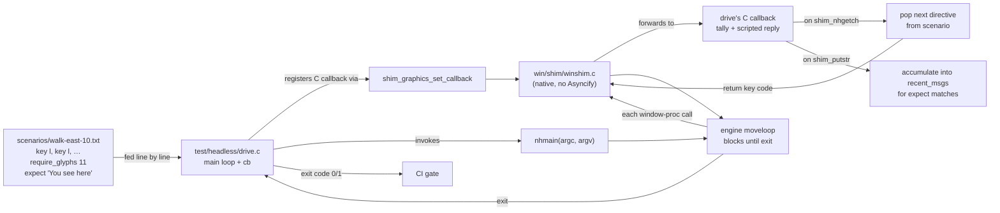

# Headless test harness

Replays scripted keystrokes against a libnh-linked NetHack and asserts on
the sequence of window-proc calls the engine makes. The keystone of the
modernization plan's regression net: catches breakages in seconds in CI,
far cheaper than a full Puppeteer run.

## How it works



The harness is a small C program — ~250 lines — that links against `libnh.a`, registers a callback with `shim_graphics_set_callback`, and replays scenario directives in lock-step with the engine's `shim_nhgetch` / `shim_yn_function` / `shim_getlin` calls. When `expect` and `require_glyphs` directives don't match observed engine output, the harness exits non-zero and CI fails fast.

## How it builds

The harness links against `src/libnh.a` (built with `WANT_LIBNH=1` per
`sys/unix/hints/linux.500:383`). That hints file is **not** the same as
`wasm.500` — the WASM build doesn't produce a static libnh.a, it
produces the WASM blob directly.

```sh
# One-time engine build (libnh.a)
cd sys/unix && sh setup.sh hints/linux.500
cd ../..
make WANT_LIBNH=1 all
make install                      # populates HACKDIR with data files

# Build + run the harness
cd test/headless && make check
```

`make check-headless` (in the top-level Makefile) wraps this.

## Scenario format

Each non-comment line is one directive:

| directive | args | meaning |
|---|---|---|
| `key <ascii>`         | one literal char  | press a single key |
| `keynum <decimal>`    | codepoint         | press key by number (use for non-ASCII keys e.g. `keynum 27` for ESC) |
| `click <x> <y>`       | cell coords       | mouse-click at cell (`x`, `y`) — engine sees CLICK_1 |
| `ans <ascii>`         | one literal char  | answer the next yn_function with this char |
| `line <text>`         | rest of line      | answer the next getlin with this text |
| `expect <substring>`  | substring         | fail unless an engine putstr / raw_print since the last `expect` contained `substring` |
| `require_glyphs <n>`  | integer           | fail if the engine has called print_glyph fewer than `n` times in total |

## Adding scenarios

Put them in `scenarios/`. Any `*.txt` file there is automatically
included by `make check`. Smaller is better: each scenario should
exercise one specific path (movement, menu, prompt, save, etc.) so a
failure points at the right place.
